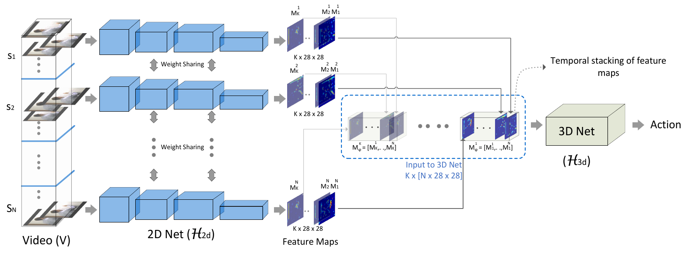
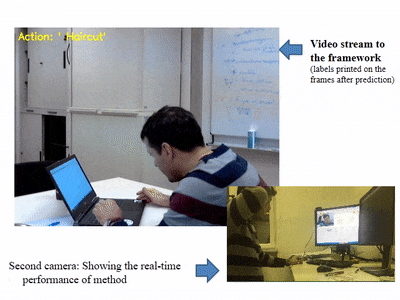

# Action Recognition
This is a very good behavior recognition project, 
Mainly put forward two points:
- Using a single frame of image, in many cases a good initial classification result can already be obtained, and a lot of information between adjacent frames is redundant. Therefore, in ECO, only a single frame of image is used in a timing neighborhood.
- In order to obtain the context between long-term image frames, it is not enough to use simple score aggregation. Therefore, in ECO, the end-2-end fusion is performed on the feature map by 3D convolution between the distant frames.
Using the form of 2D+3D, it can model space and time well. If you are interested, you can visit the original [code](https://github.com/mzolfaghari/ECO-efficient-video-understanding) . 
[eco-pytorch](https://github.com/zhang-can/ECO-pytorch).
It is a pity that I did not sort it out when I read the paper, but there are many articles on the Internet that explain the papers in detail. If you are interested in the direction of behavior recognition, it is recommended to read TSN first.
# ECO-efficient-video-understanding
#### Code and models of [paper](https://arxiv.org/pdf/1804.09066.pdf). " ECO: Efficient Convolutional Network for Online Video Understanding, European Conference on Computer Vision (ECCV), 2018." 
 By Mohammadreza Zolfaghari, Kamaljeet Singh, Thomas Brox

### NEW
:snake: [PyTorch](https://github.com/mzolfaghari/ECO-pytorch) implementation for ECO paper now is available [here](https://github.com/mzolfaghari/ECO-pytorch). Many thanks to @zhang-can.


### Update
- **2018.9.06**: Providing PyTorch [implementation](https://github.com/mzolfaghari/ECO-pytorch)
- **2018.8.01**: Scripts for online recognition and video captioning
- **2018.7.30**: Adding codes and models
- **2018.4.17**: Repository for ECO.


### Introduction
This repository will contains all the required models and scripts for the paper [ECO: Efficient Convolutional Network for Online Video Understanding](https://arxiv.org/pdf/1804.09066.pdf).




In this work, we introduce a network architecture that takes long-term content into account and enables fast per-video processing at the same time. The architecture is based on merging long-term content already in the network rather than in a post-hoc fusion. Together with a sampling strategy, which exploits that neighboring frames are largely redundant, this yields high-quality action classification and video captioning at up to 230 videos per second, where each video can consist of a few hundred frames. The approach achieves competitive performance across all datasets while being 10x to 80x faster than state-of-the-art methods.


### Results 
Action Recognition on UCF101 and HMDB51           |  Video Captioning on MSVD dataset
:-------------------------:|:-------------------------:
  |  

### Online Video Understanding Results 
Model trained on UCF101 dataset             |  Model trained on Something-Something dataset
:-------------------------:|:-------------------------:
  |  

### Requirements
1. Requirements for `Python`
2. Requirements for `Caffe` (see: [Caffe installation instructions](http://caffe.berkeleyvision.org/installation.html))

### Installation
##### Build Caffe
We used the following configurations with cmake:
- Cuda 8
- Python 3
- Google protobuf 3.1
- Opencv 3.2

    ```Shell
    cd $caffe_3d/
    mkdir build && cd build
    cmake .. 
    make && make install
    ```

### Usage

*After successfully completing the [installation](#installation)*, you are ready to run all the following experiments.

### Data list format
	```
        /path_to_video_folder number_of_frames video_label
	```
Our [script](https://github.com/mzolfaghari/ECO-efficient-video-understanding/blob/master/scripts/create_lists/create_list_kinetics.m) for creating kinetics data list.

### Training
1. Download the initialization and trained models:

	```Shell
        sh download_models.sh
	```
 This will download the following models:
 - Initialization models for 2D and 3D networks (bn_inception_kinetics and 112_c3d_resnet_18_kinetics)
 - Pre-trained models of ECO Lite and ECO Full on the following datasets:
   - Kinetics (400)
   - UCF101
   - HMDB51
   - SomethingSomething (v1)

   *We will provide the results and pre-trained models on Kinetics 600 and SomethingSomething V2 soon.
 
2. Train ECO Lite on kinetics dataset:
 
	
        sh models_ECO_Lite/kinetics/run.sh
	
### Different number of segments
Here, we explain how to modify ".prototxt" to train the network with 8 segments. 
1. In the "VideoData" layer set ```num_segments: 8``` 
2. For transform_param of "VideoData" layer copy the following mean values 8 times:
    ```
    mean_value: [104]
    mean_value: [117]
    mean_value: [123]
    ```
3. In the "r2Dto3D" layer set the shape as ```shape { dim: -1 dim: 8 dim: 96 dim: 28 dim: 28 }```
4. Set the kernel_size of "global_pool" layer as ```kernel_size: [2, 7, 7]```

 
### TODO
1. Data
2. Tables and Results
3. Demo


### License and Citation
All code is provided for research purposes only and without any warranty. Any commercial use requires our consent. If you use this code or ideas from the paper for your research, please cite our paper:
```
@inproceedings{ECO_eccv18,
author={Mohammadreza Zolfaghari and
               Kamaljeet Singh and
               Thomas Brox},
title={{ECO:} Efficient Convolutional Network for Online Video Understanding},	       
booktitle={ECCV},
year={2018}
}
```

### Contact

  [Mohammadreza Zolfaghari](https://github.com/mzolfaghari/ECO_efficient_video_understanding)

  Questions can also be left as issues in the repository. We will be happy to answer them.
